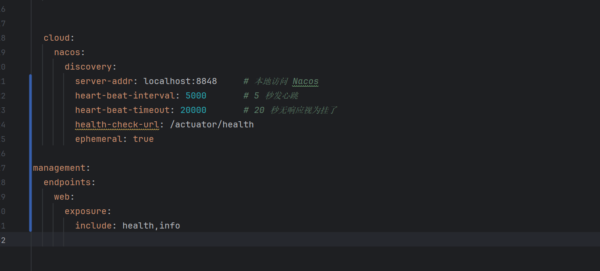
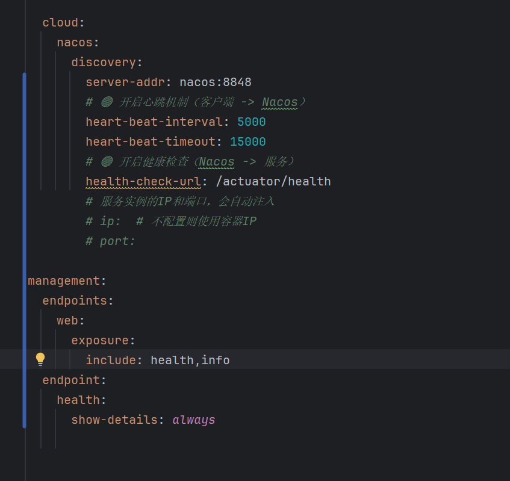
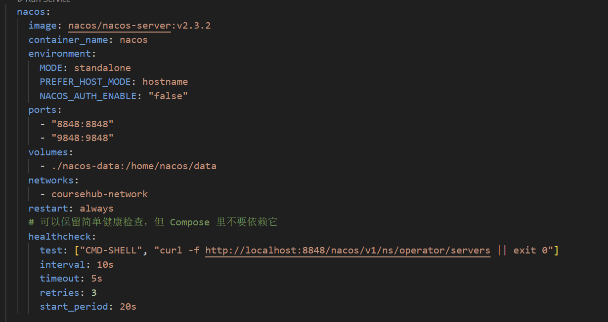
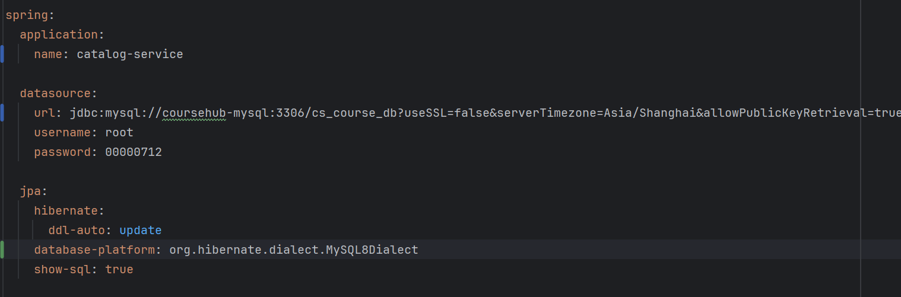
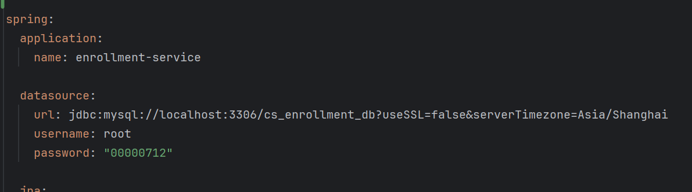
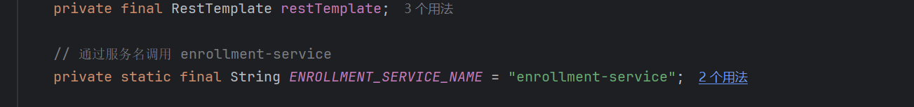
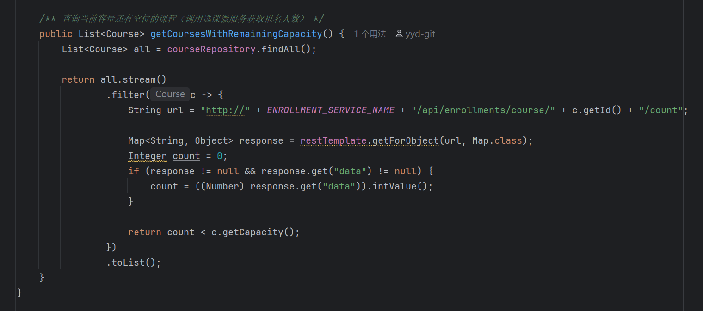
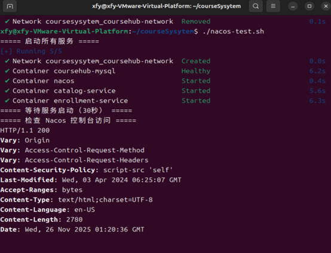
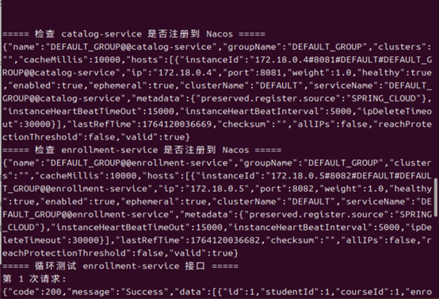
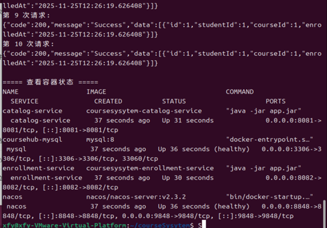

# 🎓 校园选课系统（Course Management System）

## 一、项目说明

本项目是一个基于 **Spring Boot 3.x** 的简易校园选课管理系统，
用于演示学生选课、课程管理、选课关系管理等基础功能。
系统遵循 RESTful API 设计规范，并集成 Swagger 文档方便接口调试。

### 项目模块：

- **课程管理（Course）**：支持增删改查课程信息；
- **学生管理（Student）**：支持注册、修改、删除学生信息；
- **选课管理（Enrollment）**：支持学生选课、退课及课程选课查询；
- **全局异常处理**：统一返回错误信息，符合 REST 规范；
- **数据存储**：使用内存存储（`ConcurrentHashMap` 模拟数据库）；
- **接口测试**：支持 Swagger UI 与 Apifox 导入测试。

---

## ️ 二、如何运行项目

### 📍 环境要求

| 项目        | 版本                         |
| ----------- | ---------------------------- |
| JDK         | 17 或以上                    |
| Maven       | 3.8+                         |
| Spring Boot | 3.5.6                        |
| IDE         | IntelliJ IDEA / Eclipse 均可 |

---

### 启动步骤

1. **克隆或导入项目**

   ```bash
   git clone https://github.com/yourname/course.git
   ```
2. **导入到 IntelliJ IDEA / Eclipse**
3. **运行主类**

   ```java
   com.zjsu.<你的姓名拼音缩写>.course.CourseApplication
   ```
4. **访问系统接口文档**

   ```
   http://localhost:8080/swagger-ui/index.html
   ```

---

## 三、API 接口列表

### 🎓 学生管理（StudentController）

| 方法   | 路径                   | 功能                             |
| ------ | ---------------------- | -------------------------------- |
| POST   | `/api/students`      | 创建学生                         |
| GET    | `/api/students`      | 查询所有学生                     |
| GET    | `/api/students/{id}` | 按 ID 查询学生                   |
| PUT    | `/api/students/{id}` | 修改学生信息                     |
| DELETE | `/api/students/{id}` | 删除学生（若存在选课则禁止删除） |

---

### 课程管理（CourseController）

| 方法   | 路径                  | 功能         |
| ------ | --------------------- | ------------ |
| POST   | `/api/courses`      | 创建课程     |
| GET    | `/api/courses`      | 查询所有课程 |
| GET    | `/api/courses/{id}` | 查询单门课程 |
| PUT    | `/api/courses/{id}` | 修改课程     |
| DELETE | `/api/courses/{id}` | 删除课程     |

---

### 选课管理（EnrollmentController）

| 方法   | 路径                                                | 功能               |
| ------ | --------------------------------------------------- | ------------------ |
| POST   | `/api/enrollments?studentId={sid}&courseId={cid}` | 学生选课           |
| GET    | `/api/enrollments`                                | 查询所有选课记录   |
| GET    | `/api/enrollments/student/{studentId}`            | 查询某学生选课记录 |
| GET    | `/api/enrollments/course/{courseId}`              | 查询课程对应学生   |
| DELETE | `/api/enrollments/{enrollmentId}`                 | 退课               |

---

## 四、测试说明

### 测试工具

- Swagger UI（内置接口调试）
- Apifox（导入 Swagger 文档自动生成接口）
- Postman（可选）

---

### 常规测试用例

#### 1⃣ 创建学生

```json
POST /api/students
{
  "studentId": "S2024001",
  "name": "张三",
  "major": "计算机科学",
  "grade": 2021,
  "email": "zhangsan@example.com"
}
```

**预期结果：**
返回 201 状态码 + 学生对象 JSON。

---

#### 2⃣ 创建学生时邮箱格式错误

```json
POST /api/students
{
  "studentId": "S2024002",
  "name": "李四",
  "major": "软件工程",
  "grade": 2022,
  "email": "lisi@wrong"
}
```

**预期结果：**

```json
{
  "code": 400,
  "message": "Invalid email format"
}
```

---

#### 3️ 学生存在选课时删除

```bash
DELETE /api/students/S2024001
```

**预期结果：**

```json
{
  "code": 400,
  "message": "Student cannot be deleted because there are course selections"
}
```

---

#### 4️ 查询课程列表

```bash
GET /api/courses
```

**预期结果：**
返回课程数组列表 JSON。

---

#### 5⃣ 学生选课与退课

```bash
POST /api/enrollments?studentId=S2024001&courseId=C1001
DELETE /api/enrollments/{enrollmentId}
```

**预期结果：**
选课成功返回 201，退课成功返回 204。

---

### 状态码规范

| 状态码 | 含义                   |
| ------ | ---------------------- |
| 200    | 查询成功               |
| 201    | 创建成功               |
| 204    | 删除成功（无返回内容） |
| 400    | 参数错误 / 业务错误    |
| 404    | 资源不存在             |

---

### 📎 运行截图（可在实验报告中附图）

- Swagger UI 主界面
- 创建学生成功截图
- 邮箱格式错误响应截图
- 删除学生失败截图

---

## 五、总结

- 系统实现了课程、学生与选课的完整 CRUD 流程；
- 使用统一异常处理，保证接口返回一致；
- 所有接口通过 Swagger 调试验证；
- 可进一步扩展数据库持久化与权限模块。

## 六、Docker 部署

#### 1、构建镜像

- 项目目录下有 Dockerfile，可执行以下命令：
- docker compose build

#### 2、启动服务

- docker compose up -d

#### 3、查看容器状态

- docker compose ps

## 七、微服务拆分和nacos注册

#### 1、nacos配置

- 本地配置
  
- docker部署配置
  
- 打开nacos服务方式：
  1、在本地windows环境下载nacos进入根目录，在命令行输入.\startup.cmd -m standalone
  可以通过http://localhost:8080/来进行访问

2、在docker中
可以打开http://localhost:8848/nacos/进行访问

#### 2、服务拆分

将原本服务拆成两个微服务：catalog-service和enrollment-service
分别使用cs_course_db和cs_enrollment_db两个数据库进行存储





#### 2、服务调用

RestTemplate

接口拼接调用


#### 3、服务部署和测试
- 部署compose

```
services:
  nacos:
    image: nacos/nacos-server:v2.3.2
    container_name: nacos
    environment:
      MODE: standalone
      PREFER_HOST_MODE: hostname
      NACOS_AUTH_ENABLE: "false"
    ports:
      - "8848:8848"
      - "9848:9848"
    volumes:
      - ./nacos-data:/home/nacos/data
    networks:
      - coursehub-network
    restart: always
    # 可以保留简单健康检查，但 Compose 里不要依赖它
    healthcheck:
      test: ["CMD-SHELL", "curl -f http://localhost:8848/nacos/v1/ns/operator/servers || exit 0"]
      interval: 10s
      timeout: 5s
      retries: 3
      start_period: 20s

  mysql:
    image: mysql:8
    container_name: coursehub-mysql
    restart: always
    environment:
      MYSQL_ROOT_PASSWORD: 00000712
    ports:
      - "3306:3306"
    volumes:
      - mysql_data:/var/lib/mysql
      - ./mysql-init:/docker-entrypoint-initdb.d
    networks:
      - coursehub-network
    healthcheck:
      test: ["CMD", "mysqladmin", "ping", "-h", "localhost"]
      interval: 5s
      timeout: 5s
      retries: 10
      start_period: 10s

  catalog-service:
    build:
      context: ./course
    container_name: catalog-service
    ports:
      - "8081:8081"
    environment:
      SPRING_PROFILES_ACTIVE: docker
      SPRING_CLOUD_NACOS_DISCOVERY_SERVER_ADDR: nacos:8848
    depends_on:
      mysql:
        condition: service_healthy
      nacos:
        condition: service_started
    networks:
      - coursehub-network

  enrollment-service:
    build:
      context: ./student
    container_name: enrollment-service
    ports:
      - "8082:8082"
    environment:
      SPRING_PROFILES_ACTIVE: docker
      SPRING_CLOUD_NACOS_DISCOVERY_SERVER_ADDR: nacos:8848
    depends_on:
      mysql:
        condition: service_healthy
      nacos:
        condition: service_started
      catalog-service:
        condition: service_started
    networks:
      - coursehub-network

networks:
  coursehub-network:
    driver: bridge

volumes:
  mysql_data:


```
  

- 测试
```
#!/bin/bash
set -e

echo "===== 启动所有服务 ====="
docker compose up -d

echo "===== 等待服务启动（30秒） ====="
sleep 30

echo "===== 检查 Nacos 控制台访问 ====="
curl -I http://localhost:8848/nacos/

echo ""
echo "===== 检查 catalog-service 是否注册到 Nacos ====="
curl -s "http://localhost:8848/nacos/v1/ns/instance/list?serviceName=catalog-service&groupName=DEFAULT_GROUP"

echo ""
echo "===== 检查 enrollment-service 是否注册到 Nacos ====="
curl -s "http://localhost:8848/nacos/v1/ns/instance/list?serviceName=enrollment-service&groupName=DEFAULT_GROUP"

echo ""
echo "===== 循环测试 enrollment-service 接口 ====="
for i in {1..10}; do
  echo "第 $i 次请求:"
  curl -s -X GET "http://localhost:8082/api/enrollments"
  echo ""
done

echo ""
echo "===== 查看容器状态 ====="
docker compose ps

```

输出:





